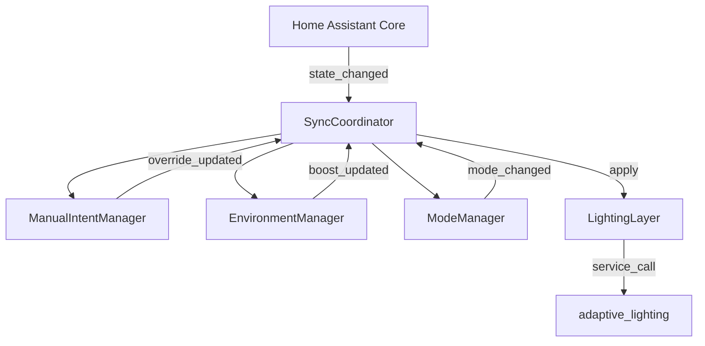

# Event Bus Topology

```mermaid
flowchart TD
    HA[Home Assistant Core] -->|state_changed| SyncCoordinator
    SyncCoordinator --> ManualIntentManager
    SyncCoordinator --> EnvironmentManager
    SyncCoordinator --> ModeManager
    ManualIntentManager -->|override_updated| SyncCoordinator
    EnvironmentManager -->|boost_updated| SyncCoordinator
    ModeManager -->|mode_changed| SyncCoordinator
    SyncCoordinator -->|apply| LightingLayer
    LightingLayer -->|service_call| adaptive_lighting
```

Each manager publishes structured events captured by diagnostics sensors. Manual overrides always preempt environmental boosts, while mode priorities guard quiet hours.
